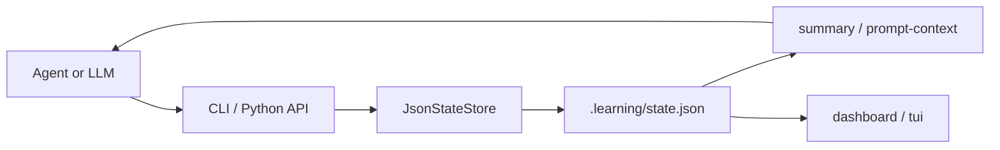

# Technical Architecture

This document is the main technical reference for developers who want to understand, maintain, or extend Learning Accelerator.

## System Boundary

Learning Accelerator is not a standalone LMS and does not try to replace an LLM. It separates responsibilities:

- The agent or LLM teaches, explains, generates exercises, evaluates answers, and diagnoses mistakes.
- The Python package stores state, keeps review schedules deterministic, exposes CLI commands, renders terminal views, and records evidence.
- The JSON state file is the durable boundary between conversations, tools, and agent runtimes.

The runtime intentionally uses only the Python standard library. Optional distribution and test tooling live in development or GitHub workflow paths, not in the core package.

## Module Map

```text
learning_accelerator/
├── __init__.py      # package exports and __version__
├── cli.py           # argparse command surface
├── dashboard.py     # one-shot human-readable terminal dashboard
├── state.py         # state schema defaults, migrations, store API, review and progress logic
└── tui.py           # interactive standard-library terminal UI
```

Supporting files:

```text
references/learning_os_protocol.md     # agent-facing operating protocol
schemas/learning_state.schema.json     # machine-readable state schema
docs/api.md                            # public Python and CLI API
docs/extending.md                      # extension rules and compatibility boundaries
docs/release.md                        # release checklist and tag workflow
```

## State Flow



Typical flow:

1. The agent reads `prompt-context` or `summary`.
2. The user learns, answers, or attempts a task.
3. The agent records `ExerciseSpec`, `AttemptRecord`, review results, concepts, and tasks through the CLI or `JsonStateStore`.
4. The store updates weak concepts, `ConceptProgress`, due reviews, priority reviews, and difficulty evidence.
5. The next turn starts from durable state instead of a blank conversation.

## Learning State Model

The state has five top-level sections:

- `learner_profile`: domain, known skills, language, experience level, goal, outcome, constraints.
- `topic_state`: current topic, level, mastered concepts, weak concepts, `concept_progress`, misconceptions, open questions.
- `practice_state`: structured exercises, attempts, completed/failed legacy exercises, tasks, code errors.
- `review_state`: due items, next review items, review history.
- `difficulty_state`: current difficulty, evidence, next adjustment.

The source of truth is `DEFAULT_STATE` in `learning_accelerator.state`. The machine-readable version is `schemas/learning_state.schema.json`.

## ExerciseSpec

`ExerciseSpec` turns agent-generated practice into durable structured data.

Required concepts:

- `topic`
- `concepts`
- `difficulty`: `easy`, `normal`, or `stretch`
- `goal`
- `task`
- `created_at`

Optional fields include input, expected output, constraints, evaluation criteria, and hint.

The LLM may generate the exercise text, but Python owns stable ids and persistence.

## AttemptRecord

`AttemptRecord` stores the result of a learner attempt.

Important fields:

- `exercise_id`
- `user_answer`
- `result`: `pass`, `partial`, or `fail`
- `score`: 0-100
- `mistake_type`
- `feedback`
- `concepts_to_review`

When an attempt is recorded, the store updates review items, weak concepts, `ConceptProgress`, and difficulty evidence.

## ConceptProgress

`ConceptProgress` tracks one concept over time:

- `strength`: 0.0-1.0 estimate
- `attempts`
- `correct_streak`
- `failure_count`
- `last_reviewed_at`
- `next_due_at`

Correct attempts increase strength and streak. Partial or failed attempts reset the streak, increase failure count, lower strength, and make the concept due immediately.

## Review Priority

`priority_reviews(on_date=None, limit=5)` ranks due review items. The priority score favors:

1. due items,
2. weak concepts,
3. low concept strength,
4. repeated failures.

Agents should use `review-priority` instead of asking the learner to review everything.

## CLI Surface

Core commands:

```bash
python -m learning_accelerator.cli version
python -m learning_accelerator.cli --state-file .learning/state.json init
python -m learning_accelerator.cli --state-file .learning/state.json summary
python -m learning_accelerator.cli --state-file .learning/state.json prompt-context
python -m learning_accelerator.cli --state-file .learning/state.json dashboard
python -m learning_accelerator.cli --state-file .learning/state.json tui
```

Learning operations:

```bash
python -m learning_accelerator.cli --state-file .learning/state.json profile --domain technology --goal "Learn FastAPI"
python -m learning_accelerator.cli --state-file .learning/state.json topic "FastAPI dependency injection" --level beginner
python -m learning_accelerator.cli --state-file .learning/state.json concept weak "dependency injection"
python -m learning_accelerator.cli --state-file .learning/state.json review "dependency injection" "Explain Depends." --result incorrect
python -m learning_accelerator.cli --state-file .learning/state.json review-priority --limit 3
```

Structured practice:

```bash
python -m learning_accelerator.cli --state-file .learning/state.json exercise-generate --topic "FastAPI" --concept "dependency injection" --difficulty normal --task "Explain Depends."
python -m learning_accelerator.cli --state-file .learning/state.json attempt record "<exercise-id>" --answer "..." --result partial --score 45 --review-concept "dependency injection"
```

## UI Layers

There are two terminal UI layers:

- `dashboard`: one-shot read-only terminal view.
- `tui`: interactive standard-library menu for dashboard, priority reviews, concept progress, due reviews, and task creation.

Both read from the same `JsonStateStore`. Neither introduces terminal UI dependencies.

## Testing Strategy

Tests cover four layers:

- `tests/test_state_store.py`: state migration, review scheduling, exercise specs, attempts, concept progress, priority reviews.
- `tests/test_cli.py`: command wiring and JSON/text outputs.
- `tests/test_dashboard.py`: deterministic dashboard rendering.
- `tests/test_tui.py`: injected input/output command loop behavior.
- `tests/test_skill_structure.py`: package completeness, docs, schema, workflows, and metadata.

Run:

```bash
python -m pytest
git diff --check
python -m json.tool manifest.json >/dev/null
python -m json.tool schemas/learning_state.schema.json >/dev/null
```

## Extension Boundary

Safe extensions:

- Add optional fields to `ExerciseSpec`, `AttemptRecord`, or `ConceptProgress`.
- Add a domain template in `DOMAIN_TEMPLATES`.
- Add new CLI commands that call `JsonStateStore`.
- Improve `priority_reviews()` while keeping output machine-readable.

Risky changes:

- Renaming existing state keys.
- Changing `schema_version` without migration.
- Making `tui` require third-party terminal packages.
- Returning non-JSON from commands intended for agent consumption.

## Release Boundary

Package version and state schema version are separate:

- `learning_accelerator.__version__`, `pyproject.toml`, and `manifest.json` describe package release version.
- `SCHEMA_VERSION` describes persisted state compatibility.

Feature releases can bump package version while keeping `SCHEMA_VERSION = 1`.

The release workflow is tag-triggered and builds artifacts only. It does not publish to PyPI automatically.
