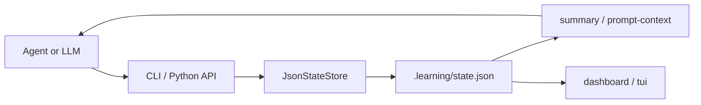

# 技术架构

本文是 Learning Accelerator 的中文技术文档，面向维护者和二次开发者。

## 系统边界

Learning Accelerator 不是完整 LMS，也不试图替代 LLM。它的边界是：

- LLM 或 Agent 负责教学、解释、生成练习、评估答案和诊断错误。
- Python 包负责状态持久化、复习调度、概念进度、CLI、dashboard 和 TUI。
- JSON 状态文件负责跨会话、跨工具、跨 Agent 保留学习上下文。

运行时只依赖 Python 标准库。测试、构建和发布工具只存在于开发或 GitHub workflow 路径里。

## 模块地图

```text
learning_accelerator/
├── __init__.py      # 包版本和导出
├── cli.py           # argparse 命令入口
├── dashboard.py     # 一次性终端 dashboard
├── state.py         # 默认 schema、迁移、状态 API、复习和进度逻辑
└── tui.py           # 标准库交互式终端 UI
```

配套文件：

```text
references/learning_os_protocol.md     # Agent 操作协议
schemas/learning_state.schema.json     # 机器可读状态 schema
docs/api.md                            # Python API 和 CLI 说明
docs/extending.md                      # 扩展规则和兼容边界
docs/release.md                        # 发布流程
```

## 状态流



典型流程：

1. Agent 读取 `prompt-context` 或 `summary`。
2. 用户学习、回答、练习或提交错误。
3. Agent 通过 CLI 或 `JsonStateStore` 写入 `ExerciseSpec`、`AttemptRecord`、复习结果、概念和任务。
4. Store 更新薄弱点、`ConceptProgress`、复习项、优先复习和难度证据。
5. 下一轮对话从持久状态继续，而不是重新开始。

## 学习状态模型

状态分为五个顶层区域：

- `learner_profile`：学习领域、已知技能、语言、经验等级、目标、结果、约束。
- `topic_state`：当前主题、等级、已掌握概念、薄弱概念、`concept_progress`、误解和开放问题。
- `practice_state`：结构化练习、attempt、历史练习、当前任务和代码错误。
- `review_state`：到期复习项、下一次复习项和复习历史。
- `difficulty_state`：当前难度、证据和下一步调整。

源码中的 `DEFAULT_STATE` 是真实默认值，`schemas/learning_state.schema.json` 是机器可读版本。

## ExerciseSpec

`ExerciseSpec` 把 Agent 生成的练习题固化为结构化数据。

关键字段：

- `topic`
- `concepts`
- `difficulty`：`easy`、`normal`、`stretch`
- `goal`
- `task`
- `created_at`

可选字段包括输入、期望输出、约束、评价标准和提示。LLM 可以生成题面，但 Python 负责稳定 id 和持久化。

## AttemptRecord

`AttemptRecord` 记录用户一次练习尝试。

关键字段：

- `exercise_id`
- `user_answer`
- `result`：`pass`、`partial`、`fail`
- `score`：0-100
- `mistake_type`
- `feedback`
- `concepts_to_review`

记录 attempt 后，系统会更新复习项、薄弱概念、`ConceptProgress` 和难度证据。

## ConceptProgress

`ConceptProgress` 跟踪单个概念：

- `strength`：0.0-1.0
- `attempts`
- `correct_streak`
- `failure_count`
- `last_reviewed_at`
- `next_due_at`

正确会提高强度和连续正确次数；`partial` 或 `fail` 会重置连续正确次数，增加失败次数，降低强度，并让概念立即到期。

## 复习优先级

`priority_reviews(on_date=None, limit=5)` 给到期复习项排序。优先级考虑：

1. 是否到期；
2. 是否是薄弱概念；
3. 概念强度是否低；
4. 失败次数是否多。

Agent 应优先使用 `review-priority`，而不是让用户复习所有内容。

## CLI 表面

核心命令：

```bash
python -m learning_accelerator.cli version
python -m learning_accelerator.cli --state-file .learning/state.json init
python -m learning_accelerator.cli --state-file .learning/state.json summary
python -m learning_accelerator.cli --state-file .learning/state.json prompt-context
python -m learning_accelerator.cli --state-file .learning/state.json dashboard
python -m learning_accelerator.cli --state-file .learning/state.json tui
```

结构化练习：

```bash
python -m learning_accelerator.cli --state-file .learning/state.json exercise-generate --topic "FastAPI" --concept "dependency injection" --difficulty normal --task "Explain Depends."
python -m learning_accelerator.cli --state-file .learning/state.json attempt record "<exercise-id>" --answer "..." --result partial --score 45 --review-concept "dependency injection"
```

## UI 层

有两个终端 UI：

- `dashboard`：一次性只读状态视图。
- `tui`：交互式菜单，可查看 dashboard、优先复习、概念进度、到期复习，并添加任务。

两者都使用同一个 `JsonStateStore`，且不引入第三方终端 UI 依赖。

## 测试策略

测试覆盖：

- `tests/test_state_store.py`：状态迁移、复习、练习、attempt、概念进度、优先复习。
- `tests/test_cli.py`：命令参数和输出。
- `tests/test_dashboard.py`：dashboard 渲染。
- `tests/test_tui.py`：注入输入输出的 TUI 循环。
- `tests/test_skill_structure.py`：包结构、文档、schema、workflow、metadata。

验证命令：

```bash
python -m pytest
git diff --check
python -m json.tool manifest.json >/dev/null
python -m json.tool schemas/learning_state.schema.json >/dev/null
```

## 扩展边界

安全扩展：

- 给 `ExerciseSpec`、`AttemptRecord`、`ConceptProgress` 添加可选字段。
- 在 `DOMAIN_TEMPLATES` 添加领域模板。
- 添加调用 `JsonStateStore` 的 CLI 命令。
- 改进 `priority_reviews()`，但保持输出机器可读。

高风险变更：

- 重命名已有状态字段。
- 没有迁移就修改 `schema_version`。
- 让 `tui` 依赖第三方终端包。
- 让给 Agent 用的命令输出非 JSON。

## 发布边界

包版本和状态 schema 版本是两件事：

- `learning_accelerator.__version__`、`pyproject.toml` 和 `manifest.json` 表示包版本。
- `SCHEMA_VERSION` 表示持久状态兼容版本。

功能发布可以升级包版本，同时保持 `SCHEMA_VERSION = 1`。
